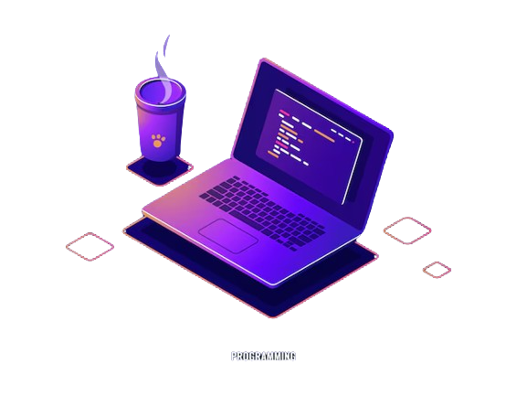

# Olá, eu sou João! 👋

## Sobre mim
- 🎓 Sou estudante de Ciência da Computação no Instituto Mauá de Tecnologia.
- 🌱 Atualmente, estou aprendendo Python, Java, JavaScript, Dart, C, SQL e R.
- 🔍 Estou explorando diferentes áreas da programação para descobrir minha paixão.

## Contato
- 📧 Email: [joaopedrosouzacruz@gmail.com](mailto:joaopedrosouzacruz@gmail.com)
- 🎓 Email institucional: [23.00057-0@maua.br](mailto:23.00057-0@maua.br)
- 🔗 LinkedIn: [João Pedro de Souza Cruz](https://www.linkedin.com/in/joão-pedro-de-souza-cruz-34a2731b4/)

## Projetos

### 👾 WizardCode
  - 📚  Jogo educacional em pixel sobre linguagens de programação desenvolvido para treinamento da linguagem Python.
  - 🔧  Python, SQL, Visual Studio Code.
  - 🌐  [Link para o Repositório](https://github.com/Pitucooh/WizardCode)
    
### 🌳 Site Usina Eco-Cultural
  - 📚  Site desenvolvido em parceria com a Usina Eco-Cultural
  - 🔧  HTML, CSS, Visual Studio Code.
  - 🌐  [Link para o Repositório](https://github.com/Pitucooh/PII-UsinaEco-Cultural)

### ⚕️ Aplicativo de análise de exames médicos
  - 📚  Aplicativo desenvolvido em parceria com o Hospital São Camilo, para análise de exames médicos.
  - 🔧  Python, JavaScript, React-Native.
  - 🌐  [Link para o Repositório](https://github.com/Pitucooh/pii-gestao-saude/)
    
## Linguagens
- 🐍 Python, ☕ Java, 🌐 JavaScript, 🖥️ HTML, 🎨 CSS, ⚙️ C, 📊 SQL, 📊 R
  
## Ferramentas
- 📝 Editor de código: Visual Studio Code

## Estatísticas do GitHub

